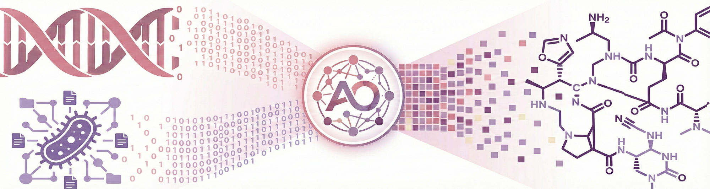
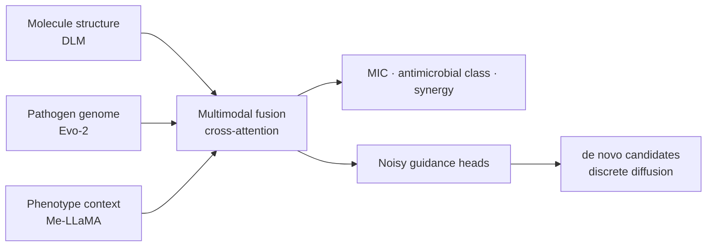

<p align="center">
  
</p>

<h1 align="center">ApexOracle</h1>

<h3 align="center">Predicting and generating antibiotics against unseen pathogens</h3>

<p align="center">
  <a href="https://scholar.google.com/citations?user=uL97fK8AAAAJ">Tianang Leng</a><sup>†</sup> ·
  <a href="https://scholar.google.com/citations?hl=en&amp;user=-_X99PYAAAAJ&amp;view_op=list_works&amp;sortby=pubdate">Fangping Wan</a><sup>†</sup> ·
  <a href="https://scholar.google.com/citations?user=N-Z6jh8AAAAJ&amp;hl=en">Marcelo D. T. Torres</a><sup>†</sup> ·
  <a href="https://delafuentelab.seas.upenn.edu/principal-investigator/">Cesar de la Fuente-Nunez</a>
  <br>
   University of Pennsylvania
  <br>
  <sup>†</sup> Equal contribution
</p>

<p align="center">
  <a href="https://arxiv.org/abs/2507.07862"></a>
  <a href="https://github.com/DragonDescentZerotsu/ApexOracle/releases/latest"></a>
  <a href="https://huggingface.co/Kiria-Nozan/ApexOracle"></a>
  <a href="https://huggingface.co/datasets/Kiria-Nozan/ApexOracle"></a>
  <a href="https://doi.org/10.5281/zenodo.15612047"></a>
  <a href="LICENSE"></a>
</p>

<p align="center">
  A modular, multimodal platform that combines molecular structure with pathogen genome and phenotype context to
  predict antimicrobial activity and guide <em>de novo</em> molecule generation.
</p>

<p align="center">
  <a href="#what-apexoracle-does"><strong>Overview</strong></a> ·
  <a href="#quick-start"><strong>Quick start</strong></a> ·
  <a href="#modular-release"><strong>Modules</strong></a> ·
  <a href="#models-and-data"><strong>Models &amp; data</strong></a> ·
  <a href="#citation"><strong>Citation</strong></a>
</p>

---

## What ApexOracle does

<table>
  <tr>
    <td width="33%" align="center" valign="top">
      <h3>🔬 Predict</h3>
      Estimate MIC, antimicrobial classification, and synergy for candidate molecules.
    </td>
    <td width="34%" align="center" valign="top">
      <h3>🧬 Condition on pathogens</h3>
      Combine Evo-2 genome representations with phenotype-derived text representations.
    </td>
    <td width="33%" align="center" valign="top">
      <h3>✨ Generate</h3>
      Guide discrete diffusion toward <em>de novo</em>, strain-conditioned candidates.
    </td>
  </tr>
</table>

ApexOracle represents molecules with a diffusion language model (DLM), combines them with complementary pathogen
representations through cross-attention, and uses task-specific heads for prediction or guidance.



## Quick start

```bash
git clone --recurse-submodules https://github.com/DragonDescentZerotsu/ApexOracle.git
cd ApexOracle
python scripts/check_module_locks.py
```

Already cloned without submodules? Run `./scripts/bootstrap.sh`.

| Goal | Entry point |
| --- | --- |
| Extract molecule embeddings with the DLM | [Hugging Face model quickstart](https://huggingface.co/Kiria-Nozan/ApexOracle) |
| Extract Evo-2 genome embeddings | [Genome embedding quickstart](quickstarts/README.md#genome-embedding-extraction) |
| Run the public MIC inference example | [MIC prediction quickstart](quickstarts/README.md#mic-prediction) |
| Generate a strain-conditioned candidate | [Guided-generation quickstart](quickstarts/README.md#guided-generation) |
| Reproduce or extend the scientific workflows | [ApexOracle-Core](modules/core) and its `experiments/` documentation |

> [!NOTE]
> Each scientific module retains its validated environment. ApexOracle intentionally does not force DLM
> pretraining, Evo-2 extraction, MIC prediction, and guided generation into one Python environment. See the
> [environment guide](environments/README.md).

## Modular release

| Module | Responsibility | Public entry point |
| --- | --- | --- |
| **ApexOracle-Core** | Prediction, fusion, training/evaluation contracts, and reproducibility workflows | [`modules/core`](modules/core) |
| **ApexOracle-DLM-Pretraining** | Collaborator-developed DLM + 209-descriptor MTR pretraining producer | [`modules/dlm_pretrain`](modules/dlm_pretrain) |
| **ApexOracle-MDLM** | Downstream molecular embedding, guidance heads, and candidate scoring | [`modules/mdlm`](modules/mdlm) |
| **ApexOracle-Evo2** | Record-aware genome embedding extraction | [`modules/evo2`](modules/evo2) |
| **ApexOracle-Generation** | Guided discrete diffusion, remasking, and paper sampling presets | [`modules/generation`](modules/generation) |

The exact gitlink for every module is fixed in [`manifests/modules.lock.yaml`](manifests/modules.lock.yaml). Scientific
implementation commits, release documentation commits, model revisions, and recovery refs are kept distinct in the
[`release provenance`](docs/RELEASE_PROVENANCE.md).

## Models and data

| Asset | Location | Scope |
| --- | --- | --- |
| Molecule DLM weights | [Kiria-Nozan/ApexOracle](https://huggingface.co/Kiria-Nozan/ApexOracle) | Molecule embedding extraction |
| DLM pretraining data | [Kiria-Nozan/ApexOracle dataset](https://huggingface.co/datasets/Kiria-Nozan/ApexOracle) | Tokenized molecular inputs and descriptor targets |
| Genome and text embeddings | [Zenodo 10.5281/zenodo.15612048](https://doi.org/10.5281/zenodo.15612048) | Paper-listed precomputed embedding archives; CC BY 4.0 |
| Paper Evo-2 genome list | [ApexOracle-Core list](modules/core/experiments/evo2_genome_embeddings/paper_genome_list.csv) | 563 genomes used by paper MIC/classification/synergy tasks, with source and file hashes |
| Classification reproduction data | [Zenodo v2.0.0](https://doi.org/10.5281/zenodo.21882300) | Exact Fig. 1b folds, nine normalized prediction tables, and metric recomputation |
| Fixed MIC reconstruction | [Zenodo v3.0.0](https://doi.org/10.5281/zenodo.21883545) | Post-paper fixed split, 21 member tables, 86,358-row ensemble, and independent metric recomputation |
| Synergy checkpoint replay | [Zenodo v4.0.0](https://doi.org/10.5281/zenodo.21883954) | High-confidence seed-0 split candidate, 21-member probabilities, 2,371 rows, and metric recomputation |
| Public model-ready tables | [Zenodo v5.0.0](https://doi.org/10.5281/zenodo.21891064) | DBAASP-derived MIC, small-molecule classification and synergy tables; private in-house MIC rows excluded |
| Peptide MIC candidate scorer | [Zenodo v2.0.0](https://doi.org/10.5281/zenodo.21882300) | All-peptide fixed-`t=1e-3` post-generation scorer; not the Generation sampler checkpoint |
| Paper strain mapping | [ApexOracle-Core mapping](modules/core/assets/manifests/paper_strain_mapping.json) | Source strain labels to canonical genome+text/text-only condition keys |
| MIC inference example | [Kiria-Nozan/ApexOracle-Core](https://huggingface.co/Kiria-Nozan/ApexOracle-Core) | Inference-only single-member checkpoint and example condition |
| Guided-generation runtime bundle | [Kiria-Nozan/ApexOracle-Generation](https://huggingface.co/Kiria-Nozan/ApexOracle-Generation) | Compact BAA-3170 smoke assets |

Immutable revisions, file sizes, checksums, licenses, and release scope are recorded in
[`manifests/model_weights.yaml`](manifests/model_weights.yaml) and
[`manifests/data_assets.yaml`](manifests/data_assets.yaml). Model weights, datasets, embeddings, caches, and raw
outputs are not stored as Git objects.

The release distinguishes runnable inference from recomputation of paper numbers. Representative inference-only
weights power the public quickstarts; paper-result recomputation uses frozen sample-level predictions, splits,
checkpoint provenance, and metric scripts instead of requiring every optimizer-bearing historical checkpoint.
The exact Fig. 1b classification capsule is public in [Zenodo v2.0.0](https://doi.org/10.5281/zenodo.21882300).
[Zenodo v3.0.0](https://doi.org/10.5281/zenodo.21883545) adds a fixed-split MIC reconstruction while retaining all
earlier assets. It is explicitly a post-paper reconstruction, not the unrecovered membership used by the 2025 MIC
checkpoints. [Zenodo v4.0.0](https://doi.org/10.5281/zenodo.21883954) adds the full 21-member synergy replay; its
seed-0 split reproduces every archived fold metric to the logged precision but remains labeled a high-confidence
candidate because the 2025 processes did not record sample-level predictions or `PYTHONHASHSEED`.
[Zenodo v5.0.0](https://doi.org/10.5281/zenodo.21891064) adds source-partitioned public model-ready tables and
retains all earlier assets; the 15,718 private in-house MIC rows are explicitly excluded. All versions
belong to the existing concept DOI `10.5281/zenodo.15612047`, not a separate Zenodo
project. See
the [reproducibility scope](docs/REPRODUCIBILITY_SCOPE.md) and
[compute requirements](docs/COMPUTE_REQUIREMENTS.md). Fresh quickstart wall time and peak RAM/VRAM are frozen in
[`manifests/quickstart_benchmarks_2026-08-11.json`](manifests/quickstart_benchmarks_2026-08-11.json). The external
[paper-data capsule plan](docs/PAPER_DATA_CAPSULE_PLAN.md) records which splits are exact, reconstructed, or still
unrecovered; the [repository hygiene policy](docs/REPOSITORY_HYGIENE.md) prevents those assets from being duplicated
into Git.

> [!IMPORTANT]
> The public MIC quickstart demonstrates one inference member. The paper metrics use the frozen seven-member
> ensemble. Likewise, the compact generation bundle validates the released runtime path; it is not itself an
> experimental activity result.

<details>
<summary><strong>Repository map</strong></summary>

```text
ApexOracle/
├── modules/
│   ├── core/             # prediction, evaluation, and reproducibility
│   ├── dlm_pretrain/     # DLM + MTR pretraining producer
│   ├── mdlm/             # embeddings, guidance heads, and scoring
│   ├── evo2/             # genome embedding extraction
│   └── generation/       # guided discrete diffusion
├── quickstarts/          # runnable public examples
├── environments/        # per-module environment policy
├── manifests/           # immutable module and asset records
├── scripts/             # bootstrap, validation, and archive tools
└── docs/                # release status and provenance
```

</details>

<details>
<summary><strong>Release integrity and complete source archive</strong></summary>

The latest maintenance release is `v0.2.3`; it corrects the name of a fixed-`t=1e-3` downstream MIC scorer without
changing checkpoint bytes, model behavior, or scientific protocols. To create a source-only archive that expands
all five fixed submodules:

```bash
python scripts/build_source_archive.py --output ApexOracle-source.tar.gz
python scripts/check_source_archive.py ApexOracle-source.tar.gz
```

The builder emits deterministic JSON provenance and a SHA-256 sidecar. A prebuilt archive is also attached to the
[GitHub release](https://github.com/DragonDescentZerotsu/ApexOracle/releases/tag/v0.2.3), because GitHub's automatic
source ZIP does not expand submodules.

</details>

## Citation

If ApexOracle is useful in your work, please cite the paper and the software release you used:

```bibtex
@article{leng2025predicting,
  title   = {Predicting and generating antibiotics against future pathogens with ApexOracle},
  author  = {Leng, Tianang and Wan, Fangping and Torres, Marcelo Der Torossian and de la Fuente-Nunez, Cesar},
  journal = {arXiv preprint arXiv:2507.07862},
  year    = {2025}
}
```

Machine-readable software and dataset citation metadata are available in [`CITATION.cff`](CITATION.cff).

## License and history

The super-repository orchestration layer is released under the [MIT License](LICENSE). Each submodule retains its own
license; see [`NOTICE`](NOTICE) before redistribution. The pre-conversion monorepo remains recoverable from branch
`legacy-monorepo` and annotated tag `legacy-monorepo-snapshot-2026-08-10`.
